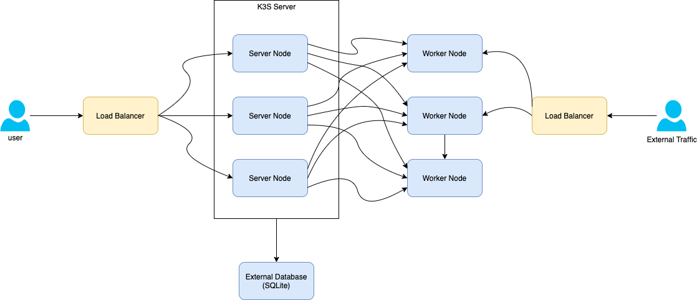

# Tools on the Cloud: EKS, AKS, GKE, Kops
There are two methods for orchestration in the cloud environment. 

- Managed for Control Plane layer by Cloud Provider.
- Managed by the Infrastructure Team.

## Managed for Control Plane layer by Cloud Provisioner

- AWS EKS (Elastic Kubernetes Service)
- Azure AKS (Azure Kubernetes Service)
- Google GKE (Google Kubernetes Engine)

### Comparision Chart between cloud providers

| Service     | EKS   | AKS   | GKE   |
|:------------|:------|:------|:------|
| Upgrade Cluster Nodes | Manual and Automatic Options | Manual | Fully Managed Upgrade |
| Dedicated Monitoring | CloudWatch | Azure Monitor | Kubernetes Engine Monitoring |
|Availability Zones | More zone than others | ***** | **** |
| CLI support | OK | OK, plus special eksctl | OK |
| HA availability | OK for control plane, manual across AZ for workers | N/A | OK regional cluster for master and workers |
| Time to Spawn Cluster(3 nodes) | ~10m | ~6m | ~3m |
| K8s version tracking | | Better than EKS | |
| Bare Metal Nodes | OK | N/A | N/A |
| On-Premise | EKS Anywhere | ARC (beta) | Anthos |
| Security | Strong security with  RBAC and IAM integration | RBAC Implemented as fully supported | RBAC Implemented as fully supported |
| Pricing | 0.10$/hour + nodes | Only pay Worker Nodes | 0.10$/hour + nodes |

## Managed by the Infrastructure Team

- Kops (Kubernetes Operations)

Kops is a tool that helps you manage Kubernetes components as systemd services and static pods. You can use kops to create your infrastructure framework to manage your clusters based on as-code principles.

Here is a Kops cluster templating example for framework architecture.
```
# file cluster.yaml
apiVersion: kops.k8s.io/v1alpha2
kind: Cluster
metadata:
 name: .
spec:
 docker:

 additionalPolicies:
   master: |

   node: |


# File nodes.yaml ~ master.yaml
apiVersion: kops.k8s.io/v1alpha2
kind: InstanceGroup
metadata:
 labels:
 kops.k8s.io/cluster: .
 name: nodes
spec:
 image: coreos.com/CoreOS-stable-1409.6.0-hvm
 kubernetesVersion:
 machineType: m4.large
 maxPrice: "0.5"
 maxSize: 20
 minSize: 15
 role: Node
 rootVolumeSize: 100
 subnets:
 - a
 - b
 - c


   kops toolbox template \
   --values values.yaml \
   --template templates/cluster/cluster.yaml \
   --template templates/cluster/master.yaml \
   --template templates/cluster/nodes.yaml \
   --format-yaml \
   --output /tmp/cluster.yaml

   cat /tmp/cluster.yaml

   kops replace --force -f /tmp/cluster.yaml
```

As you can see above, kops manages your cluster nodes and components such as kubelet, api-server and etcd in a cluster and instance groups files as shown below.

Support: [Docs](https://kubernetes.io/docs/setup/production-environment/tools/kops/), open issues from [GitHub](https://github.com/kubernetes/kops).

### Kops Pros/Cons:

| Pros | Cons |
|:-----|:-----|
| Declarative provisioning with YAML files and cli tool |  It‘s available for only cloud systems. (stable AWS) | 
| Well-documented | It lags to support new Kubernetes versions. |
| Can generate Terraform | |
| Fully-customizable | |
| Support for custom Kubernetes add-ons | |

# Tools for On-Premise Environments: Kubespray, Kubeadm RKE, K3S

## Kubespray
Kubespray is a framework that installs and manages systemd services and static pods. It uses kubeadm in the background. Generally, Kubespray is managed by ansible playbooks. Also, it has Terraform modules too.

Thanks to those Ansible Playbooks, you can edit your cluster nodes and their roles in the inventory.ini file from kubespray [GitHub](https://github.com/kubernetes-sigs/kubespray/blob/master/inventory/sample/inventory.ini) repository. You can also develop cluster components and network configurations in [k8s-cluster.yaml](https://github.com/kubernetes-sigs/kubespray/blob/master/inventory/sample/group_vars/k8s-cluster/k8s-cluster.yml).

### Kubespray Pros/Cons:

| Pros | Cons |
|:-----|:-----|
| Declarative installation with variables and inventory | Installation takes long |
| Available for on-premises, bare-metal, and clouds. | |
| Easy customization with Ansible | |
| Support for custom Kubernetes add-ons | |
| It has terraform modules for AWS and OpenStack environments. | |

Installation takes a long time to execute your changes because Ansible works sequentially, but if you know Ansible, you can easily manage your clusters with Kubespray.

Support: [Docs](https://kubernetes.io/docs/setup/production-environment/tools/kubespray/), open issues from [GitHub](https://github.com/kubernetes-sigs/kubespray/issues).

## Kubeadm

kubeadm allows you to install and manage Kubernetes components as systemd services clusters. It is an official installation method suggested by CNCF.

You can develop a framework or use kubespray instead of using kubeadm alone. This configuration is more efficient, especially at HA installations.

### kubeadm Pros/Cons:

| Pros | Cons |
|:-----|:-----|
| Official installation method | Still in beta |
| Effortless installation | HA installation needs some manifest file development |
| Can be used cloud or bare-metal | |

A lot of Kubernetes installation options(kubespray etc.) implement kubeadm into their process. But if you want to use kubeadm purely, you should consider extra development processes for HA setup. For example, you should design your framework based on your requirements (e.g., cloud-manager, load balancer setup .. etc.)

Support: [Docs](https://kubernetes.io/docs/setup/production-environment/tools/kubeadm/create-cluster-kubeadm/) and [Github](https://github.com/kubernetes/kubeadm).

## RKE

RKE is a new tool by Rancher that installs and manages kubernetes components as docker containers kubernetes clusters. RKE can be run on the cloud or on-premises.

You can manage RKE easily by a single yaml file, shown below.
```
nodes:
   - address: #
     internal_address: #
     user: centos
     ssh_key_path: /Users/Desktop/rke.pem
     role:
       - controlplane
       - worker
       - etcd
   - address: #
     internal_address: #
     user: centos
     ssh_key_path: /Users/Desktop/rke.pem
     role:
       - controlplane
       - worker
       - etcd

services:
   etcd:
     snapshot: true
     creation: 6h
     retention: 24h
  # Required for external TLS termination with
 # ingress-nginx v0.22+
ingress:
   provider: nginx
   options:
     use-forwarded-headers: "true"

kubernetes_version: v1.18.3-rancher2-2
```

### RKE Pros/Cons:

| Pros | Cons |
|:-----|:-----|
| Easy installation | New solution for kubernetes installations and management |
| Declarative approach, only one YAML | |
| Easy automation | |
| Can be used on cloud or bare-metal | |
| Well-documented | |
| Back-up solution for etcd | |

RKE is a new solution compared to the other installation solutions. But you can easily manage and automate your cluster management and provisioning steps.

Support: [Docs](https://rancher.com/docs/rke/latest/en/), enterprise support 7/24 give on the Rancher, and you can open issues from [Github](https://github.com/rancher/rke).

## K3S

K3s is developed for IoT and Edge applications. K3S strips out many legacy features/plugins and substitutes Kubernetes components for lightweight alternatives to achieve a binary size of ~60MB. For example, it uses sqlite instead of etcd. K3S is suggested for local or dev/test/stg installations.

An example of K3S architecture is shown below:



### K3S Pros/Cons:

| Pros | Cons |
|:-----|:-----|
| Low resource requirements and low cost. | Require development for heavy load. |
| It is a perfect option for local installations. | |
| Start up time compared k8s | |

Support: [Docs](https://rancher.com/docs/k3s/latest/en/), enterprise support 7/24 give on the Rancher, and you can open issues from [Github](https://github.com/k3s-io/k3s).

# Conclusion

**GKE** is the go-to implementation with **easy set-up** and regional HA cluster features.
**AWS** has a few distinguishing features, such as support for **bare metal nodes**, and it has a beneficial IAM service when integrated with RBAC for cluster security. 
**AKS** faster than AWS for provisioning clusters, but it has a disadvantage for regional cluster replication than other providers.

When looking at the managed control plane by the infrastructure teams side, **RKE** has useful features such as **easy automation**, managing only one YAML and **back-up solution** for **etcd**. 
**Kubespray** is a practical framework with ansible. Kops helps management clusters if you create your scripts or framework, but it has the disadvantage of only running at AWS as stable. 
Finally, **K3S** is a perfect option for **local environments** or low load production environments.